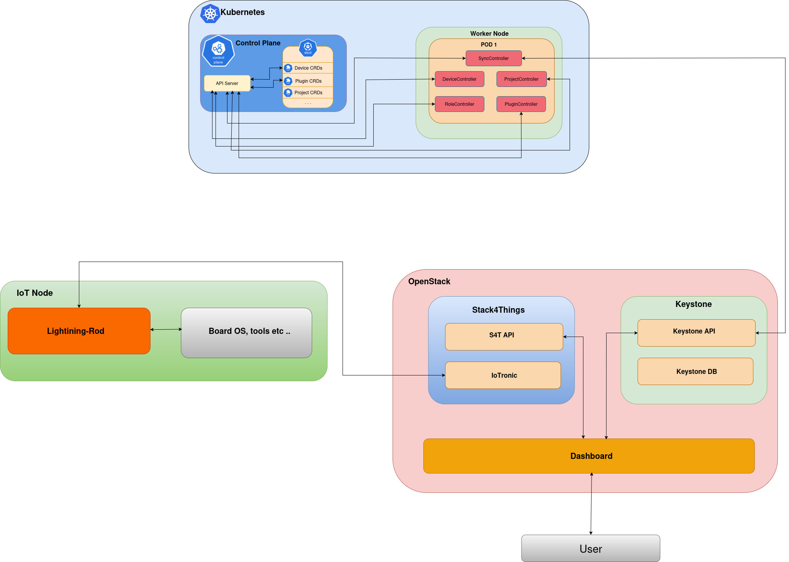

# kubernetes-keystone-integration

Integration layer between **OpenStack Keystone** and **Kubernetes** to enable unified authentication, authorization, and resource synchronization across cloud and edge environments.

---

## Overview

This project aims to bridge **OpenStack Keystone** — the identity and access management service of OpenStack — with **Kubernetes**, providing a **single source of identity** for both cloud and edge resources.

---

## Architecture

The integration relies on a custom **Kubernetes Operator** (written in Go with Kubebuilder) that periodically synchronizes information between Keystone and the Kubernetes API.

The architecture includes several components:

| Controller / Component           | Repository        | Description                                                                                   |
|----------------------------------|-------------------|-----------------------------------------------------------------------------------------------|
| **RBACController**               | rbac-operator     | Standalone Kubernetes operator built with Kubebuilder.                                        |
|                                  |                   | Responsible for LOCAL cluster resources:                                                      |
|                                  |                   | - Creates per-project Namespace                                                               |
|                                  |                   | - Creates per-user Role and RoleBinding (OIDC preferred_username)                             |
|                                  |                   | - Creates Keystone authentication Secret                                                      |
|                                  |                   | - Handles local cleanup via finalizers                                                        |
|                                  |                   | Does NOT interact with Stack4Things.                                                          |
|----------------------------------|-------------------|-----------------------------------------------------------------------------------------------|
| **ProjectController**            | s4t-provider      | Part of the Crossplane Provider for Stack4Things.                                             |
|                                  |                   | Watches the `Project` custom resource.                                                        |
|                                  |                   | Uses the Secret created by RBACController to authenticate to S4T.                             |
|                                  |                   | Creates/updates/deletes projects on Stack4Things via Connector + ExternalClient.              |
|                                  |                   | Syncs remote S4T project state back into the Project CR status.                               |
|----------------------------------|-------------------|-----------------------------------------------------------------------------------------------|
| **DeviceController**             | s4t-provider      | Crossplane managed resource controller.                                                       |
|                                  |                   | Synchronizes IoTronic/Stack4Things devices with Kubernetes `Device` CRs.                      |
|                                  |                   | Handles: Observe, Create, Update, Delete for S4T devices.                                     |
|----------------------------------|-------------------|-----------------------------------------------------------------------------------------------|
| **PluginController**             | s4t-provider      | Crossplane managed resource controller for IoTronic plugins.                                  |
|                                  |                   | Responsible for injecting/uninjecting plugins on devices via S4T API.                         |
|                                  |                   | Ensures plugin lifecycle on S4T matches the state of the `Plugin` CR in Kubernetes.           |

---

## Goals

- Enable **Single Sign-On (SSO)** between OpenStack and Kubernetes via OIDC
- Maintain **consistent multi-tenant RBAC policies** across systems
- Represent **IoT/edge resources** (via Stack4Things) as Kubernetes-managed entities
- Provide a foundation for **unified cloud-edge orchestration**
- Allowing the user to manage Stack4things projects and resources through Kubernetes using the same Identity provided by Keystone
---

## Stack

- **Language:** Go (Kubebuilder and Crossplane provider)
- **Identity provider:** OpenStack Keystone
- **Edge framework:** Stack4Things (IoTronic)
- **Authentication:** OIDC federation
- **Target platform:** Kubernetes ≥ 1.28

---

## 📜 License

MIT License © 2025
