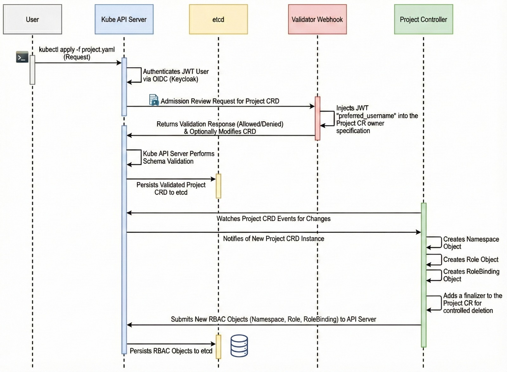
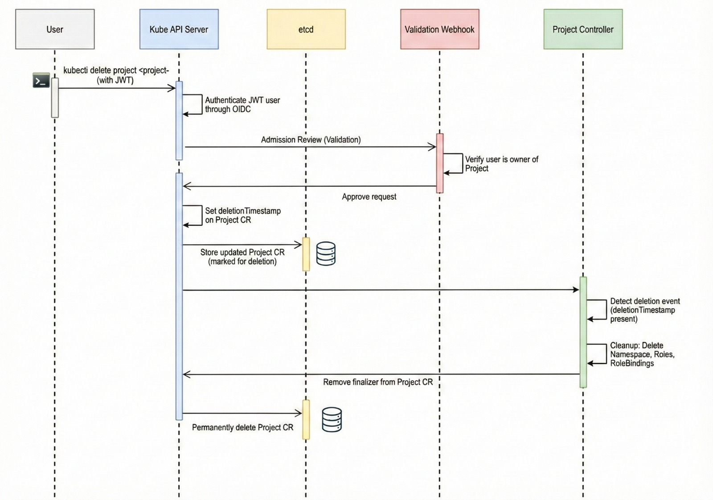

# Kubernetes-Keystone-Federation

Integration layer between **OpenStack Keystone** and **Kubernetes** to enable unified authentication, authorization, and resource synchronization across cloud and edge environments.

---

## Overview

This project aims to bridge **OpenStack Keystone** — the identity and access management service of OpenStack — with **Kubernetes**, providing a **single source of identity** for both cloud and edge resources.

While Keystone provides robust identity management for OpenStack, it has **limited native support for multi-cloud or cross-platform authentication**. In particular:

- Keystone’s federated identity support is designed primarily for OpenStack itself, making direct integration with Kubernetes OIDC non straightforward.
- It does not natively issue tokens that are directly consumable by Kubernetes, requiring mapping or translation layers.
- Multi-tenant and multi-IdP scenarios are cumbersome to manage solely within Keystone.

To overcome these limitations, **Keycloak is introduced as a federated Identity Provider (IdP)**. Keycloak enables:

- Standardized **OIDC token issuance** consumable by Kubernetes API server.
- Seamless **federation of external IdPs** (e.g., corporate SAML/LDAP) into a unified identity model.
- Dynamic **group and role mapping** that can be synchronized with Keystone, allowing RBAC enforcement across both OpenStack and Kubernetes.

By integrating Keycloak, this layer provides a **single authentication point** for users across cloud and edge, while allowing Keystone to continue managing OpenStack-native roles and projects.

## Architecture

The integration is composed of two main components:

### 1. **Stack4Things RBAC Operator (Kubernetes Operator)**

A custom Kubernetes Operator written in Go with Kubebuilder.  
It is responsible for managing *local cluster resources* derived from Keystone
information and user project definitions.  
This controller handles:

- Automatic creation of per-project Kubernetes Namespaces  
- Dynamic creation of project-level Roles that reflects the IoTronic Stack4things Roles (`admin_iot_project`, `manager_iot_project`, `user_iot`)  
- RoleBinding generation based on federated OIDC/Keystone groups  
  following the `s4t:<owner>-<projectName>:<role>` naming convention  
- Local project lifecycle cleanup via finalizers  
- Setting the Project CR status to **Ready**

**It ensures that every Keystone project has an isolated Kubernetes environment
with consistent, group-based RBAC enforcement.**

### 2. **Stack4Things Provider (Crossplane Provider)**
A Crossplane Provider that integrates Kubernetes with the Stack4Things
(IoTronic) platform.  
It consumes the resources prepared by the RBAC Controller and manages
*remote resources* inside Stack4Things, such as:

- S4T Projects  
- Devices  
- Plugins 
- Service
- BoardPluginInjection
- BoardServiceInjection

**The provider implements the Crossplane `Connector` and `ExternalClient` pattern
to synchronize the state of Kubernetes CRDs with the corresponding resources in
Stack4Things, ensuring end-to-end lifecycle management.**

---


| Controller / Component           | Repository        | Description                                                                                   |
|----------------------------------|-------------------|-----------------------------------------------------------------------------------------------|
| **RBACController**               | rbac-operator     | Standalone Kubernetes operator built with Kubebuilder.                                        |
|                                  |                   | Responsible for LOCAL cluster resources:                                                      |
|                                  |                   | - Creates per-project Namespace                                                               |
|                                  |                   | - Creates project-level Roles (admin / member / user)                                         |
|                                  |                   | - Creates RoleBindings based on federated OIDC groups                                         |
|                                  |                   | - Creates Keystone authentication Secret                                                      |
|                                  |                   | - Handles local cleanup via finalizers                                                        |
|                                  |                   | Does NOT interact with Stack4Things.                                                          |
|                                  |                   |                                                                                               |
| **ProjectController**            | s4t-provider      | Part of the Crossplane Provider for Stack4Things.                                             |
|                                  |                   | Watches the `Project` custom resource.                                                        |
|                                  |                   | Uses the Secret created by RBACController to authenticate to S4T.                             |
|                                  |                   | Creates/updates/deletes projects on Stack4Things via Connector + ExternalClient.              |
|                                  |                   | Syncs remote S4T project state back into the Project CR status.                               |
|                                  |                   |                                                                                               |
| **DeviceController**             | s4t-provider      | Crossplane managed resource controller.                                                       |
|                                  |                   | Synchronizes IoTronic/Stack4Things devices with Kubernetes `Device` CRs.                      |
|                                  |                   | Handles: Observe, Create, Update, Delete for S4T devices.                                     |
|                                  |                   |                                                                                               |
| **PluginController**             | s4t-provider      | Crossplane managed resource controller for IoTronic plugins.                                  |
|                                  |                   | Responsible for injecting/uninjecting plugins on devices via S4T API.                         |
|                                  |                   | Ensures plugin lifecycle on S4T matches the state of the `Plugin` CR in Kubernetes.           |

---

## Create S4T Project

Creating a new `Project` resource automatically initializes the corresponding Stack4Things environment for the authenticated user.  
The flow involves OIDC authentication, a Mutating Admission Webhook, etcd persistence, and the RBAC Operator that prepares the user’s development space.



### Flow Summary

- The user authenticates to the Kubernetes API Server by configuring their
  `kubectl` context with an OIDC JWT issued by Keycloak (federated Identity Provider),
  and then creates a new `Project` resource via:

  ```bash
  kubectl apply -f project.yaml
  ```

- The Kubernetes API Server validates the JWT via OIDC, verifies its signature and
  claims, and extracts the user identity and group memberships.
- The **Mutating Webhook** injects the authenticated username into `spec.owner`.
- The new Project CR is validated and persisted in **etcd**
- The **RBAC Operator** detects  the new Project resource and provisions the required access control and isolation primitives:
  - a dedicated Namespace for the project;  
  - a set of Roles defining project-level permissions;
  - a corresponding set of RoleBindings that bind federated identity groups to those Roles.  
- For each S4T Project, the RBAC Operator creates and manages a set of **federated groups** following a deterministic naming convention:
```bash
s4t:<owner>-<projectName>:<role>
```

where `<role>` can be one of:

- `admin_iot_project`  
  Full administrative permissions on the project.
- `manager_iot_project`  
  Developer / power-user permissions.
- `user_iot`  
  Read-only or limited service usage permissions.

These groups are bound to the corresponding Kubernetes `Role` objects through `RoleBinding` resources, enabling RBAC enforcement based on OIDC group claims.
- Once the RBAC setup is complete, the operator marks the Project as Ready, enabling the S4T Crossplane provider to manage the corresponding remote resources in Stack4Things.

---

## Update S4T Project 

Not Allowed

---

## Delete S4T Project



---

## Goals

- Enable **Single Sign-On (SSO)** between OpenStack and Kubernetes via OIDC
- Maintain **consistent multi-tenant RBAC policies** across systems
- Represent **IoT/edge resources** (via Stack4Things) as Kubernetes-managed entities
- Provide a foundation for **unified cloud-edge orchestration**
- Allowing the user to manage Stack4things projects and resources through Kubernetes using the same Identity provided by Keystone
---

## Stack

- **Language:** Go (Kubebuilder and Crossplane S4T provider)
- **Identity provider:** Keycloak
- **Identity service:** OpenStack Keystone
- **Edge framework:** Stack4Things 
- **Authentication:** OIDC federation 
- **Platform:** Kubernetes

---

## 📜 License

MIT License © 2025
